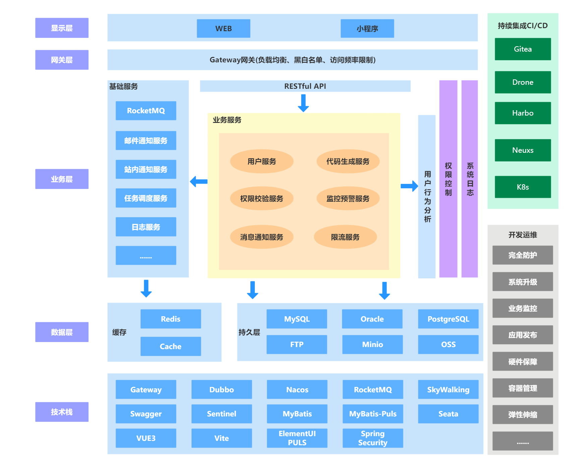

# 系统说明

- 基于 Spring Cloud 2021 、Spring Boot 2.7、 Spring Security 的权限管理系统
- 采用前后端分离的模式,前端(基于 FateVerse-React, FateVerse-Vue)
- 注册中心,配置中心使用Nacos,权限认证使用Spring Security + Redis
- 流量控制使用Sentinel，分布式事务选用Seata
- gitea+drone+harbor+rancher全套部署流程

## 快速开始

### 核心依赖

| 依赖                   | 版本         |
|----------------------|------------|
| Spring Boot          | 2.7.5      |
| Spring Cloud         | 2021.0.5   |
| Spring Cloud Alibaba | 2021.0.4.0 |
| Mybatis              | 3.5.2      |
| Vue                  | 3.1.3      |
| React                | 3.1.3      |

### 模块说明

```lua
FateVerse
├── auth -- 授权服务提供
└── common -- 系统公共模块
     ├── common-code -- 代码引擎的基础封装
     ├── common-core -- 公共工具类核心包
     ├── common-decrypt -- 加密模块
     ├── common-dubbo -- dubbo rpc服务
     ├── common-email -- 邮件发送服务
     ├── common-excel -- excel导出模块
     ├── common-file -- 分布式文件存储
     ├── common-lock -- 分布式锁模块
     ├── common-mybatis -- mybatis 扩展封装
     ├── common-mybatis-puls -- mybatis-puls 扩展封装
     ├── common-redis -- redis序列化封装
     ├── common-seata -- seata模块
     ├── common-security -- 系统权限控制模块
     ├── common-swagger -- swagger接口文档
     └── common-log -- 系统日志记录
└── notice -- 通用消息公告模块
     ├── notice-api -- 通用消息公告模块公共api模块
     └── notice-biz -- 通用消息公告模块业务处理模块[5000]
└── admin -- 通用用户权限管理模块
     ├── admin-api -- 通用用户权限管理系统公共api模块
     └── admin-biz -- 通用用户权限管理系统业务处理模块[4000]
├── sql -- 数据库文件
└── visual -- 图形化管理模块
     ├── code-gen -- 代码生成模块
     ├── monitor -- 服务监控
     └── sentinel-dashboard -- sentinel 官方版
└── nacos_config.zip -- nacos基础配置
```

### 本地开发 运行

### 对象存储

在 SpringBoot **FTP**、**minio**、**FastDFS**、**阿里云OSS**

### 系统架构图



### 压力测试

- 4*8 单节点测试结果
  